# Amazon-Product-Review-Analysis
This project was completed as part of a Data Analysis Training Program with **IncubatorHub**, under the **Digital Skillup Africa (DSA)** initiative. It simulates the role of a Data Analyst at RetailTech Insight, focusing on analyzing real Amazon product review data. The primary aim was to uncover insights related to customer sentiment, product performance, and pricing effectiveness.
The entire project was executed using Microsoft Excel, demonstrating key data analysis skills such as data cleaning, exploratory data analysis (EDA), analytical thinking, and dashboard reporting.

## Project Objectives
- Clean and prepare Amazon product review data for meaningful analysis
- Perform Exploratory Data Analysis (EDA) to uncover trends and patterns
- Conduct in-depth analysis through guided analytical tasks to understand:
    -  Customer behavior and sentiments
     - Rating distribution across product
     - Product performance and pricing effectiveness .

  ## Dataset Description 
The dataset contains information scraped from Amazon product pages, including: • Product details: name, category, price, discount, and ratings • Customer engagement: user reviews, titles, and content • Each row represents a unique product, with aggregated reviewer data stored as comma-separated values. **Total Records: 1,465 rows**
**TotalFields: 16 columns**

## Exploratory Data Analysis (EDA)
The EDA phase focused on understanding the raw dataset, identifying potential quality issues, and exploring general trends of the dataset. Key steps included:
Checking for and handling of data types, missing values, and duplicates outlier
Cleaning and formatting columns like  product names, prices,  Product  category, rating and others
Visualizing distributions of ratings, discounts, and price ranges.
Exploring category-level summaries and review count variations.
Reviewing category-wise summaries and identifying patterns in review counts
This phase helped ensure data readiness for deeper insights.
Key steps included:
## Checking for and handling of  missing values, duplicates  and Blank cell to ensure accuracy and data consistency.

### Checking for and Removing Duplicates
Since each row represents a unique product, the Product ID must be unique. Duplicate rows with the same Product ID and Product Name can distort key metrics such as average rating, total reviews, and total revenue during analysis. To remove duplicates, the entire dataset was selected, and the Remove Duplicates feature was applied using:
**Home > Data Tools > Remove Duplicates in Excel.**
A total of 114 duplicate rows were removed, reducing the dataset to 1,351 unique product entries.
## Handling Missing Values and Data Validation
During the exploration of the raw dataset, I used the filter tool to inspect each column for missing values, inconsistencies, and formatting errors.
In **Column H**, I identified an incorrectly formatted price value: 1,39,900 instead of the correct 1,390,900. To correct this, I filtered the column, unchecked all values, selected the incorrect entry, updated it to the correct format, and then re-applied the filter to restore the full dataset view. This ensured accuracy in subsequent Analysis 
Handling Blank Cells in Column L
**Column L** contained two blank cells, which were identified using the filter tool. These blanks were replaced with 0 using the Replace shortcut (Ctrl + H) to maintain data consistency.
**Column I contains '|'**, it was filter and replaced with 0 through filter and replace tool.
Cleaning Special Characters in Column I
**Column I** contained the character ‘|’, which was identified using the filter tool. It was then replaced with 0 using the Find and Replace function for consistency.
## Cleaning and Formatting Columns and Data Types
The Category column contained subcategories separated by the pipe symbol (|). To clean and format this column:
1. The entire column was copied to a new worksheet.
2. Using the Text to Columns feature, the data was split at each | symbol.
3. To reconstruct a meaningful main category, the **CONCATENATE** function was used along with the ISBLANK function:
**=IF(ISBLANK(C2), B2, CONCATENATE(B2, " & ", C2))**
4. The result was then copied and pasted back into the main dataset, replacing the original Category column.
This process ensured each product had a clear and consistent category label, suitable for grouping and filtering during analysis.
## Data Type Handling for Consistency
To ensure consistency and accurate analysis:
- Percentages were converted to whole numbers for easier comparison.
- Prices were formatted as numbers to enable calculations like revenue and discount analysis.
- Ratings and Review Counts were changed to numeric types for proper aggregation.
- Product IDs/Names were kept as text to preserve formatting.
These changes were necessary to avoid errors during filtering, sorting, and performing calculations, and to maintain data integrity throughout the analysis process.

### Visualizing distributions of ratings, discounts, and price
### Exploring category-level summaries and review count variations.
### Reviewing category-wise summaries and identifying patterns in review counts
This phase helped ensure data readiness for deeper insights. 

### Raw Dataset
 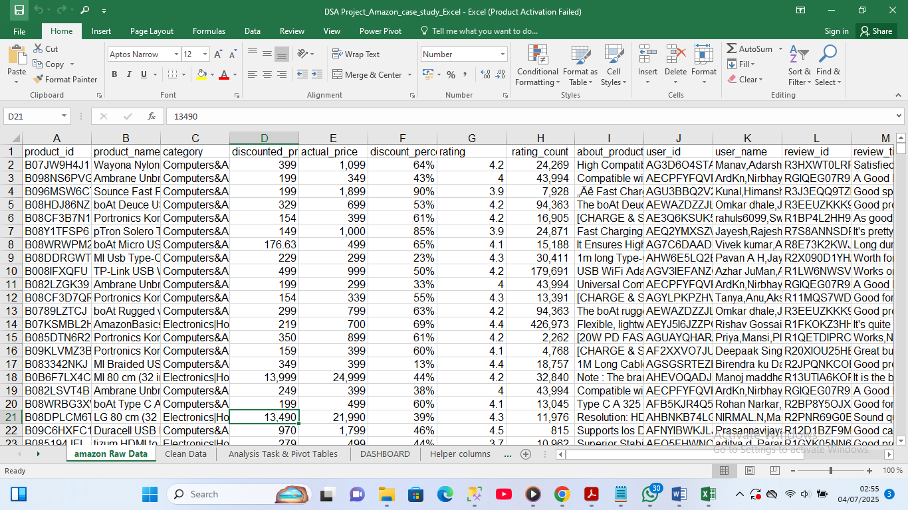 

 
### leaned Dataset
 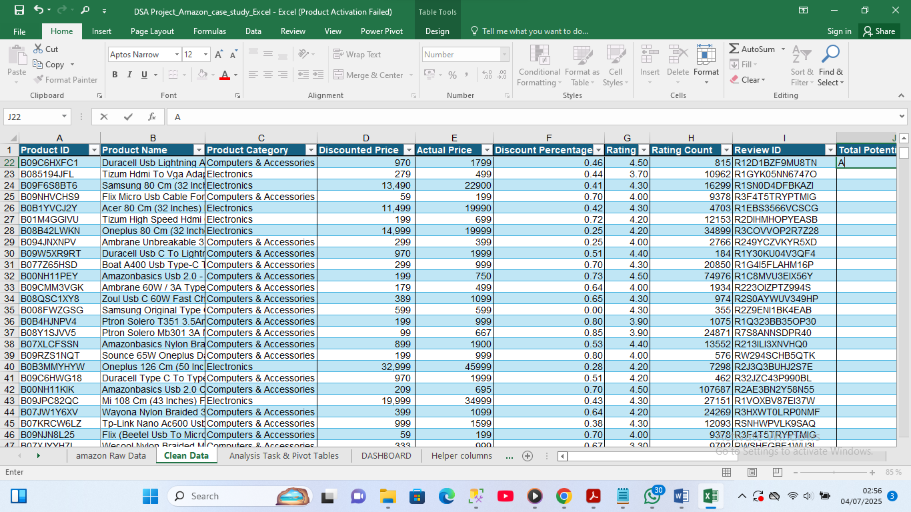
 
 
 
## Analysis Tasks
Following the Exploratory Data Analysis (EDA), further analysis was conducted to derive meaningful business insights. The tasks below were completed using pivot tables and calculated columns, as specified in the project brief.  

### TASK 1. 
To determine average discount percentage by product category  
Since there is  discount percentage column already in the data set, to validate the values,
**I added a calculated column: = (Actual Price - Discounted Price) / Actual Price * 100** to confirm the values.

Then l use a **Pivot Table with**  
**Rows**: Category 
**Values:** Discount % → summarized value by Average  
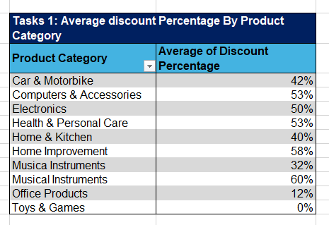

*Insight:** it Highlighted which categories offer the largest price cuts, guiding discount strategy*

### TASK 2.
To determine No of products that are listed under each category   

**Pivot Table**:  
**Rows:** Category   
**Values**: Product id → Summarized value by to Count   
  
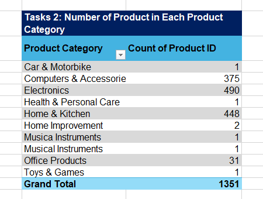
    
*Insight: Helped assess product diversity within each category.*

### TASK 3. To determine the Total number of reviews per category 
I Used Rating Count column

**Pivot Table:**  
**Rows:** Category  
**Values**: Rating Count → Summarized  values by sum  
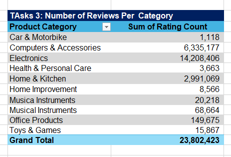

*Insight: Revealed which categories receive the most customer engagement.*     

### TASK 4. To determine Which products have the highest average ratings  
I Sorted the dataset by the **Average Rating column (descending)*
And Pick top entries  

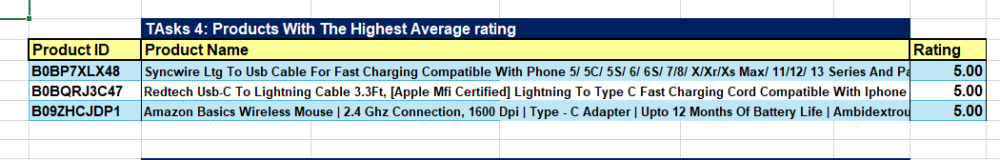

*Insight: This Identified standout products for promotion or feature placement*  
  

### TASK 5: Average Actual Price vs Discounted Price by Category  

Method Used: Pivot Table< br>
*Rows**: Category  
*Values:**  
Actual Price → summarized values by Average  
Discounted Price → summarized values by Average  
 
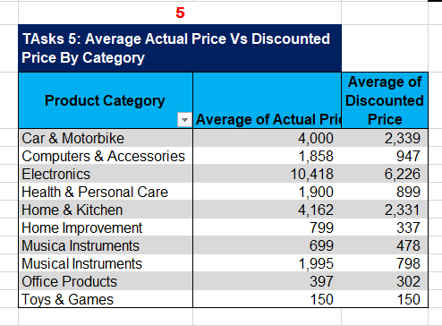 

*Insight: Helped evaluate pricing competitiveness and customer value perception.*
  

### TASK 6: To determine Which products have the highest number of reviews 
Approach: I Sorted Rating Count column in descending order 

*Insight: Flagged popular products that drive the most feedback and interaction*. 
### TASK 7: How many products have a discount of 50% or more  
Method: I Added calculated column name it "Discount % >= 50"  
Computer it with the function =IF(Discount % >= 50, "Yes", "No")  
Then use a COUNTIF to count the "yes"   

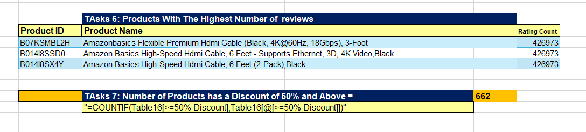
*Insight: Measured the extent of aggressive discounting in the catalog.*
  

### TASK 8: For Distribution of product ratings

I used : Pivot Table:

**Rows:** Rating
**Values:** Product Id → summarized by Count.  
**Insight:** Assessed overall sentiment and product quality levels.*  
<table>
  <tr>
    <td align="center">
      <strong>Task_8</strong> 
      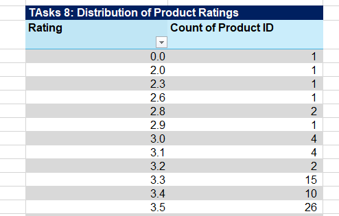
    </td>
    <td align="center">
      <strong>task_8</strong> 
      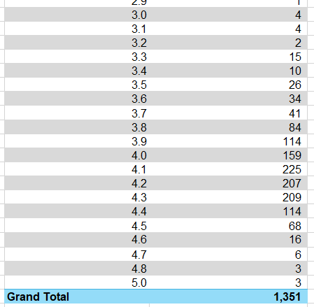
    </td>
  </tr>
</table>   

### TASK 9. To analysis Total potential revenue by category  

*Method used calculated column with Pivot table*  
**Calculated column:** "potential Revenue" 
Then used this formula to filled it *=Actual Price * Rating Count*  

**Pivot Table:** 
**Rows:** Category 
**Values:** Potential Revenue → Summarized by sum 
*Insight: Estimated sales opportunity and high-performing categories.* 
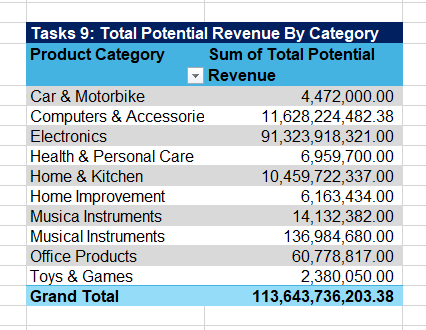
 

### TASK 10. Number of unique products per price range bucket
**Created a new column** - Price Bucket: 
**Excel formular =IF(Discounted Price < 200, "<₹200",IF(Discounted Price <= 500, "₹200–₹500", ">₹500"))  
Then used:Pivot Table: 
**Rows:** Price Bucket  
**Values:** Product Name → summarized  values by Count 

Insight: it can Helped visualize product affordability and market segmentation.  
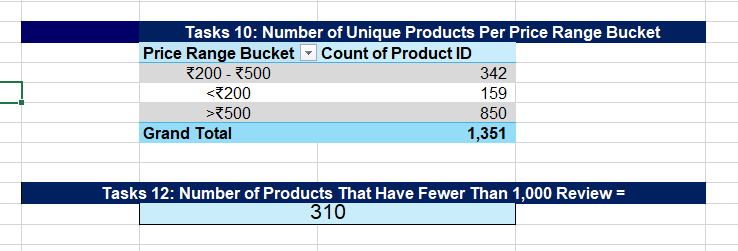

### TASK 11. How does the rating relate to the level of discount

**Method used:** Create a scatter chart:

**X-axis:** Discount %
**Y-axis:** Average Rating summarized by Average 
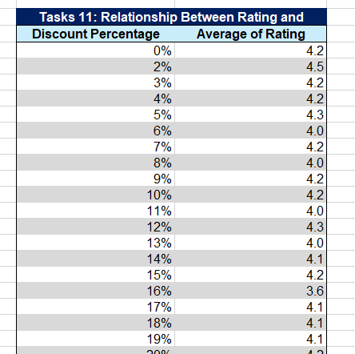
*Insights : Some products were heavily discounted (up to 90%) but still received low ratings indicating quality issues.

 12. To know How many products have fewer than 1,000 reviews
on my helper work sheet, creat a calculated column on with the formula IF(Review count >= 1000, "Yes", "No")
Then used COUNT to count the "yes"
Insight: it Identified products lacking exposure or needing more marketing.

13. Which categories have products with the highest discounts

I Used the earlier Discount % column

Pivot Table:
Rows: Category
Values: Discount % → summarized by Max
Insight: it Pinpointed heavily discounted categories, potentially at risk of over-promotion or clearance.

14. To determine Top 5 products by rating + number of reviews combined
Method: Create calculated column:
=Average Rating + (Rating Count / Scaling Factor)
(I Chosed a factor of 1000 to balance weight)

Then Sorted the Columbus  descending and pick top 5.
Insight: Balanced popularity and customer satisfaction to identify top performers.

Core Findings from the Analysis Task
- Top-rated products were mostly found in the electronics and accessories categories, showing consistent customer satisfaction.

-  Products with high discount percentages attracted more reviews, suggesting a price-sensitivity trend among customers.

- Customer ratings generally leaned positive, with a majority of products rated between 4.0 and 5.0 stars.

- Pricing effectiveness varied 
          (a) some highly-priced items still performed well, indicating value-driven buying behavior.
            (b)Most products had ratings between  4.0 and 5.0, suggesting general customer satisfaction.
            (c) Some products were heavily discounted (up to **90%**) but still received low ratings, indicating quality issues.
 - Most products had ratings between  4.0 and 5.0, suggesting general customer satisfaction.
- Review patterns helped reveal customer priorities like durability, charging speed, and compatibility in tech-related products.

##Tools /Technique Used
Microsoft Excel 2016
Data Cleaning (Find & Replace, Filters, Formulas)
Exploratory Data Analysis (Pivot Tables, Charts)
Conditional Formatting
Dashboard Design & Reporting

